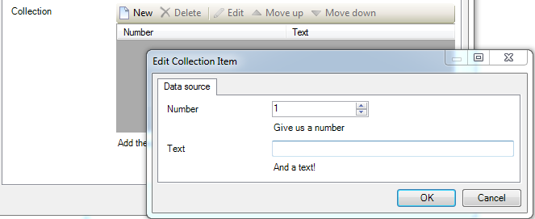

# Widgets - XML reference guide


This is the reference guide for the widget XML.


## Requirements

This reference guide assumes you have a basic understanding of XML and the Mendix Business Modeler. For more information on XML, visit [W3 Schools - XML](http://w3schools.com/xml/). To learn more about the Mendix Business Modeler, watch the [Getting Started](https://gettingstarted.mendixcloud.com/index.html) videos.

## Start of the widget XML

An XML file always starts with the XML version and encoding declaration. These are standard and should be present in every XML file. The Mendix Business Modeler uses the widget XML file to create the property input fields, which show up when you add your widget to a form. Our widget declaration XML starts at the **<widget>** element. This is the root element that will contain all our settings for this widget.

## <a name="Widgets-XMLreferenceguide-Widgetattributes" rel="nofollow"></a>Widget element

### Attributes

<table><thead><tr><th class="confluenceTh">Attribute</th><th class="confluenceTh">Description</th></tr></thead><tbody><tr><td class="confluenceTd">id</td><td class="confluenceTd">The id is where your widget is located. The path to the js file, starting at the root folder, separated by dots. Note that this is case-sensitive.</td></tr><tr><td class="confluenceTd"><h4 id="XMLReferenceGuide-needsEntityContext">needsEntityContext</h4></td><td class="confluenceTd">This boolean determines if your widget requires an object to be passed as the EntityContext and is required. If this is set to "true", the widget can only be used within a dataview or a templategrid. If set to "false", the widget can be used anywhere, but won't have an object passed to it automatically.</td></tr><tr><td colspan="1" class="confluenceTd"><h4 id="XMLReferenceGuide-xmlns">xmlns</h4></td><td colspan="1" class="confluenceTd"><p>The XML namespace used by the widget. The value of this attribute is the same for every widget.</p><div class="code panel pdl"><div class="codeContent panelContent pdl"><pre class="theme: Confluence; brush: xml; gutter: true">&lt;widget id="HelloWorld.widget.helloworld" needsEntityContext="true" xmlns="http://www.mendix.com/widget/1.0/"&gt;</pre></div></div></td></tr></tbody></table>

#### <a name="Widgets-XMLreferenceguide-id" rel="nofollow"></a>

### Child elements

Inside the widget element are 4 child elements.

<table><thead><tr><th class="confluenceTh">Element</th><th class="confluenceTh">Description</th></tr></thead><tbody><tr><td class="confluenceTd">Name</td><td class="confluenceTd">The name property is what your widget will be called in the Mendix Business Modeler. It will also be used to name the different instances of your widget by adding a number to the end of it each time it is used in a form.</td></tr><tr><td class="confluenceTd">Description</td><td class="confluenceTd">The description determines the mouse-over tooltip over your widget in the Custom Widgets toolbar.</td></tr><tr><td colspan="1" class="confluenceTd">Icon</td><td colspan="1" class="confluenceTd">Every element or widget in the Modeler has its own icon. Your new widget's icon can be defined with this property. It is a&nbsp;<a href="http://en.wikipedia.org/wiki/Base64" class="external-link" rel="nofollow">Base64</a>&nbsp;representation of the image, so that it can be used in an XML file.</td></tr><tr><td colspan="1" class="confluenceTd">Properties</td><td colspan="1" class="confluenceTd"><div><p>The individual property elements will be grouped inside the “properties” element.</p></div><div><p>&nbsp;</p><div class="code panel pdl"><div class="codeContent panelContent pdl"><pre class="theme: Confluence; brush: xml; gutter: true">&lt;widget id="HelloWorld.widget.HelloWorld" needsEntityContext="true" xmlns="http://www.mendix.com/widget/1.0/"&gt;
  &lt;name&gt;HelloWorld&lt;/name&gt;
  &lt;description&gt;The description of this widget.&lt;/description&gt;
  &lt;icon&gt;&lt;!-- Base64 icon here --&gt;&lt;/icon&gt;
  &lt;properties&gt;
   &lt;!-- Define the widget properties here --&gt;
  &lt;/properties&gt;
&lt;/widget&gt;</pre></div></div></div></td></tr></tbody></table>

#### <a name="Widgets-XMLreferenceguide-Name" rel="nofollow"></a>

## Property element

Any properties you define in your widget XML file can be set using the Mendix Business Modeler and they will be passed to your JavaScript file, so you can use them in your widget.

### Child elements

Every property element contains at least the following 3 child elements.

<table><thead><tr><th class="confluenceTh">Element</th><th class="confluenceTh">Description</th></tr></thead><tbody><tr><td class="confluenceTd">Caption</td><td class="confluenceTd">This element is used to add the name of the property. This is how it will show up in the Properties list in the Mendix Business Modeler.</td></tr><tr><td class="confluenceTd">Category</td><td class="confluenceTd">This element defines in what category this property will be shown in the Properties list in the Mendix Business Modeler. Common categories are “Behavior”, “Appearance” and “Data source”.</td></tr><tr><td colspan="1" class="confluenceTd">Description</td><td colspan="1" class="confluenceTd">This element is used to add a useful description of the property, so the end user knows what it’s for.</td></tr></tbody></table> 

### Attributes

All property elements define at least 2 attributes: **key** and **type**. The value of **key** is the name of the property in your widget, so use a descriptive name. The value of **type** refers to the type of the property, for example “string” or “integer”. Based on the type of the property, you may have to define additional attributes and/or child elements.

Other possible attributes are:

<table><thead><tr><th class="confluenceTh">Attribute</th><th class="confluenceTh">Description</th></tr></thead><tbody><tr><td class="confluenceTd">isList</td><td class="confluenceTd">Only used for the Object property type.</td></tr><tr><td class="confluenceTd"><h4 id="XMLReferenceGuide-entityProperty">entityProperty</h4></td><td class="confluenceTd">Assigns a entity to a property. This should point to the&nbsp;<strong>key</strong>&nbsp;attribute of the&nbsp;<strong>entity&nbsp;</strong>to which it is related.</td></tr><tr><td colspan="1" class="confluenceTd"><h4 id="XMLReferenceGuide-defaultValue">defaultValue</h4></td><td colspan="1" class="confluenceTd">The default value that a property starts with when it is created.</td></tr><tr><td colspan="1" class="confluenceTd"><h4 id="XMLReferenceGuide-required">required</h4></td><td colspan="1" class="confluenceTd">Specifies if the property is a required field or not. Defaults to "True" if not present.</td></tr><tr><td colspan="1" class="confluenceTd"><h4 id="XMLReferenceGuide-isDefault">isDefault</h4></td><td colspan="1" class="confluenceTd">Marks a property as the default property that is selected when the widget is selected.</td></tr><tr><td colspan="1" class="confluenceTd"><h4 id="XMLReferenceGuide-isPath">isPath</h4></td><td colspan="1" class="confluenceTd"><p><em>("no" | "optional" | "yes")</em></p><p>The path for an attribute or entity property, it can be either "no", "optional" or "yes", where "no" is the default value if the property is left out. The "optional" means that the attribute/entity can be either the current entity (or an attribute of the current entity) or an entity (or attribute) over a 1-deep association.</p></td></tr><tr><td colspan="1" class="confluenceTd"><h4 id="XMLReferenceGuide-pathType">pathType</h4></td><td colspan="1" class="confluenceTd"><p><em>("reference" | "referenceSet")</em></p><p>This defines what sort of reference should be shown for an entity/attribute over an association, either a "reference" or a "referenceSet".</p></td></tr></tbody></table>

The different property types and their respective required attributes are discussed below.

## <a name="Widgets-XMLreferenceguide-" rel="nofollow"></a>Property types

<div class="alert alert-info">

Every property requires the **key** and **type** attribute.
Any property can have the  **isDefault** or **required**  attribute.

Note that the **required** attribute defaults to "true".

</div>

### Attribute

A property of type Attribute is always related to an entity: it uses the entityContext if it is set on true, otherwise an entityProperty is required. It enables the user in the Mendix Business Modeler to select one of the attributes of the related entity (optionally over an association).

```xml
<property key="backgroundColor" type="attribute" entityProperty="color">
 <caption>Background Color</caption>
 <category>Data source</category>
 <description></description>
 <attributeTypes>
   <attributeType name="String" />
 </attributeTypes>
</property>
```

An attribute property has an extra required child element: a list of attributeTypes that define what type of attributes are accepted. This could be any of the following:

*   AutoNumber

*   Binary

*   Boolean

*   Currency

*   DateTime

*   Decimal (Modeler > v5.13)

*   Enum

*   Float

*   HashString

*   Integer

*   Long

*   String

### Boolean

A property of type Boolean requires the attribute defaultValue.

```xml
<property key="isVisible" type="boolean" defaultValue="true">
 <caption>Visibility</caption>
 <category>Data source</category>
 <description>Whether the widget is initially visible.</description>
</property>
```

What it looks like in the Mendix Business Modeler:


### Entity

A property of type Entity allows the user to configure an entity in the Mendix Business Modeler. This entity can then be used in your JavaScript to retrieve all the necessary information.

```xml
<property key="color" type="entity" isPath="optional" pathType="reference">
 <caption>Color</caption>
 <category>Data source</category>
 <description>The Color entity to use.</description>
</property>
```

### EntityConstraint

The EntityConstraint lets you put a constraint on either the entity you specify with entityProperty or, if needsEntityContext is set to true and no entityProperty is defined, to the entity passed as context.

```xml
<property key="constraint" type="entityConstraint" entityProperty="color">
 <caption>Color constraint</caption>
 <category>Data source</category>
 <description>The xpath constraint on the entity.</description>
</property>
```


### Enumeration

The enumeration property has an extra required child element: a list of enumerationValues. An enumerationValue contains a **key** attribute and a **caption** within their tag.

This presents the user with a dropdown list of options, based on the **captions** in the Mendix Business Modeler. The **keys** will reach your widget's JavaScript as an enumeration. 

It requires a default value to be set, which should correspond with one of the enumerationValue keys.

```xml
    <property key="colorEnum" type="enumeration" defaultValue="xff0000">
      <caption>Textcolor</caption>
      <category>Appearance</category>
      <description>The textcolor of the message in the widget</description>
      <enumerationValues>
        <enumerationValue key="xff0000">Red</enumerationValue>
        <enumerationValue key="x000000">Black</enumerationValue>
        <enumerationValue key="xffffff">White</enumerationValue>
      </enumerationValues>
    </property>
```

What it looks like in the Mendix Business Modeler:


### Form

The form property lets you pass a form to the widget. If needsEntityContext is set to "true", it automatically receives the object context.

```xml
<property key="helpForm" type="form">
 <caption>Help Form</caption>
 <category>Behaviour</category>
 <description>Form to open</description>
</property>
```
<div class="alert alert-info">

**Forms containing a dataview**
Remember that calling a form  with a dataview, if needsEntityContext is set to "false" in your widget, still requires an object to work.

</div>


### Image

The image property lets the user select an image from the Mendix Business Modeler's images to pass it to the widget.

```xml
<property key="picture" type="image">
 <caption>Picture</caption>
 <category>Data Source</category>
 <description>Select an image to add.</description>
</property>
```

### Integer

#### <a name="Widgets-XMLreferenceguide-Integer" rel="nofollow"></a>

The integer property lets you to pass an integer to the widget.  This property requires the attribute defaultValue.

```xml
<property key="height" type="integer" defaultValue="1">
 <caption>Height</caption>
 <category>Appearance</category>
 <description>The height of the widget</description>
</property>
```


### Microflow

The Microflow property allows a user to select a microflow in the Mendix Business Modeler. There are 3 options:

1.  If needsEntityContext is set to "true", the selected microflow is required to have the context entity as an input parameter (as this will automatically be passed into it).
2.  If needsEntityContext is set to false and no entityProperty attribute is specified, the microflow will have no input parameters.
3.  If the entityProperty attribute is specified, the selected microflow is required to have this entity as an input parameter.

```xml
<property key="messageMicroflow" type="microflow" required="false">
 <caption>Message Microflow</caption>
 <category>Data source</category>
 <description>Return value: the message to show.</description>
 <returnType type="String" />
</property>
```

The Microflow property has an extra required child element: returnType. Use this to set what type of variable you expect as a return value. The Modeler will then enforce this on the microflow that is assigned.

Possible return types:

*   Void

*   Boolean

*   Integer

*   Float

*   DateTime

*   String

*   Object

### Object

The object property is an array of packaged sub-properties. It packages multiple other properties into an object, of which multiple can be passed to the widget. It always requires the isList attribute, which needs to be set to "true".

```xml
<property key="collection" type="object" isList="true">
 <caption>Collection</caption>
 <category>Appearance</category>
 <description>Add the properties to show in your collection</description>
 <properties>
	<!-- Define the sub-properties here -->
	<property key="number" type="integer" defaultValue="1">
     <caption>Number</caption>
     <category>Data source</category>
     <description>Give us a number</description>
    </property>
    <property key="text" type="string">
     <caption>Text</caption>
     <category>Data source</category>
     <description>And a text!</description>
    </property>
 </properties>
</property>
```

What it looks like in the Mendix Business Modeler:



### String

The string property lets you to pass a string to the widget.

```xml
<property key="message" type="string">
 <caption>Message</caption>
 <category>Data source</category>
 <description>A hardcoded message</description>
</property>
```


### TranslatableString

The translatableString property is similar to a normal string property, except you can add translated versions of the default value for different languages. To achieve this, the translatableString property has an extra required child element:  a list of translations.The Mendix Business Modeler language will match the assigned <translation> value.

```xml
<property key="translatableMessage" type="translatableString">
 <caption>Message</caption>
 <category>Data source</category>
 <description>A hardcoded message</description>
 <translations>
  <translation lang="en_US">Add your message here.</translation>
  <translation lang="nl_NL">Vul hier je bericht in.</translation>
 </translations>
</property>
```

What it looks like in the Mendix Business Modeler: 


<div class="alert alert-info">
Remember to use the correct language notation according to the [Java supported locales](http://java.sun.com/javase/6/docs/technotes/guides/intl/locale.doc.html).
</div>

# Related content

*   [Getting started with the Widget Development Plugin for Adobe Brackets](/howto50/Getting+started+with+the+Widget+Development+Plugin+for+Adobe+Brackets)
*   [Creating a chainable Custom Widget](/howto50/Creating+a+chainable+Custom+Widget)
*   [Creating a Basic Hello World Custom Widget](/howto50/Creating+a+Basic+Hello+World+Custom+Widget)
*   [The Mobile Slider Custom Widget](/howto50/The+Mobile+Slider+Custom+Widget)
