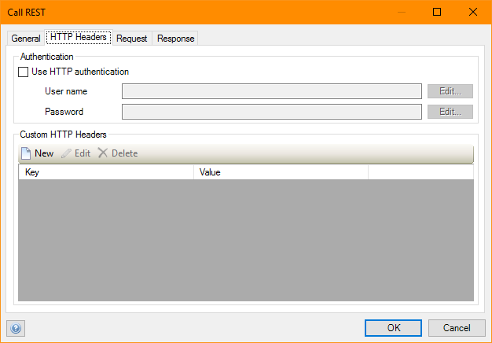
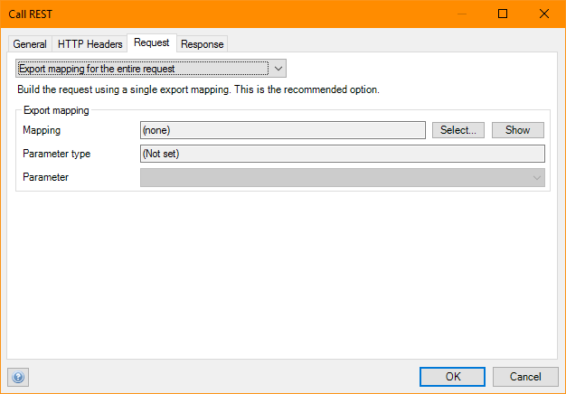
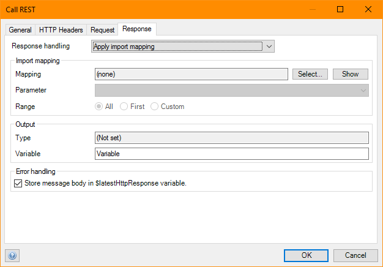

The Call REST activity can be used to call a REST endpoint. You can specify the location and how the response of the REST call should be handled.

## General

The **Location** property defines the REST endpoint to be called. The location needs to be entered using a string template. The string template should result in a valid URL string. Parameters can be used by writing a number between braces (for example, `{1}`). For each parameter in the template, you can specify its value using a [Microflow Expression](microflow-expressions) resulting in a string value. To escape the opening brace (`{`), a double opening brace should be used (`\{\{`).

The **HTTP method** property defines the HTTP method to use when calling a REST endpoint. The possible values are: GET, POST, PUT, PATCH, DELETE.

## HTTP Headers

### Authentication

The **Use HTTP authentication** check box defines whether basic authentication should be used.

The **User name** property defines the user name that will be used to authenticate over HTTP. The user name needs to be entered using [Microflow Expressions](microflow-expressions). The microflow expression should result in a string.

The **Password** property defines the password that will be used to authenticate over HTTP. The password needs to be entered using [Microflow Expressions](microflow-expressions). The microflow expression should result in a string.

### Custom HTTP Headers

These headers are added to the HTTP request header. Each custom header is a pair with a key and a value (a microflow expression).

## Request

The sections below describe the options in the drop-down menu for generating the request. Requests can only be generated for HTTP methods POST, PUT and PATCH.

### Export Mapping for the Entire Request

This option allows you to use a single [Export Mapping](export-mappings) for the body of the request. You can choose the export mapping to use for the request part and, if applicable, the object that you want to use as parameter for the mapping.

### Binary for the Entire Request

This option allows you to send binary data (the contents of a FileDocument, for example).

### Custom Request Template

This option allows you to generate the request using a string template. The template defines the structure of the request in plain text. Parameters can be used by writing a number between braces (for example, `{1}`). For each parameter in the template, you can specify its value using a [Microflow Expression](microflow-expressions) resulting in a string value. To escape the opening brace (`{`), a double opening brace should be used (`\{\{`).

## Response

### Response Handling

These are the options in the drop-down menu for handling the response:

* **Apply import mapping** – if the response is JSON or XML, it can be transformed directly into objects using an [Import Mapping](import-mappings)
* **Store in an HTTP response** – any successful HTTP response can be stored directly in an `HttpResponse` object, and the [$latestHttpResponse](call-rest-action#latesthttpresponse-variable) variable is also updated
* **Store in a file document variable** – if the response is a binary content (for example, a PDF), it can be stored in an entity – this entity should inherit from `System.FileDocument`
* **Store in a string** – if the response is a string (for example, CSV), it can be stored directly in a string variable
* **Do not store in a variable** - use this option when the call does not return anything useful.

### Output

The **Type** field defines the type of the output variable.

The **Name** field defines the name for the variable that will hold the result of the operation.

### Error Handling

This section is applicable when the HTTP response status code is not successful (for example, a redirection [3xx] or an error [4xx and 5xx]).

When the **Store message body in $latestHttpResponse variable** option is selected, `$latestHttpResponse/content` will be set with the response body. It might contain some useful information provided by the server (for example, why the authentication is rejected).

### $latestHttpResponse Variable

The `$latestHttpResponse` variable is of the `HttpResponse` type. It is available after a Call REST activity.

However, its `Content` attribute will be left empty in most cases in order to minimize memory usage.

This attribute is filled when one of the following scenarios occur:
* The **Response handling** is **Store in an HTTP response** and the call succeeded
* The **Store message body in $latestHttpResponse variable** option in the **Error handling** section is checked and the call failed

This variable can be accessed from any microflow action in the scope.

### HttpResponse Entity

The `HttpResponse` entity has the following attributes:

|  Attribute  |  Type  |  Description  |
|  ---  |  ---  |  ---  |
|  `HttpVersion`  |  String  |  The protocol version, for example, `HTTP/1.1`.  |
|  `StatusCode`  |  Integer  |  The HTTP status code that the service returned.  |
|  `ReasonPhrase`  |  String  |  A description of the `StatusCode`.  |
|  `Content`  |  String  |  The body of the response. |

You can also retrieve `HttpHeader` via its association. This entity stores the header information in the form of a key value pair.

For more information on HTTP status codes, see the [W3C Specification of Status Code Definitions](https://www.w3.org/Protocols/rfc2616/rfc2616-sec10.html).
