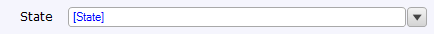

A drop-down is an [input widget](input-widgets) that can be used to display and edit enumeration attributes. It should not be confused with a reference selector, which is used to select a object with which to fill an [association](associations).



 
 
This drop-down widget allows the user to select the state of the customer.



## General Properties

### Empty Option Caption

This property represents the caption for the empty option in the drop-down shown to the user. This is a translable text. For more details, see [Translatable Texts](translatable-texts).



Filling out the caption for an empty option increases the user experience of your application. It also helps screen-reader users to operate the application easily. For example, the drop-down that represents the color selection for a car could have a caption reading "Select a color."





The empty option caption is available from Mendix 7.1.0.







## Data Source Properties





## Editability Properties







## Visibility properties



## Events Properties







## Common Properties









## Related Content

*   [Data View](data-view)
*   [Attributes](attributes)
