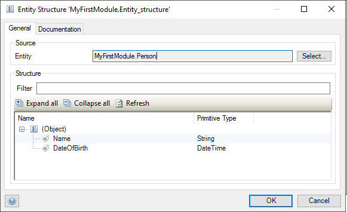

## 1 General Tab

Use an entity structure document to specify how an entity gets converted into JSON. You can use entity structures in [import](import-mappings) and [export mappings](export-mappings).

### 1.1 Entity

Select an entity that you would like to convert into JSON.

The tree structure shows the selected entity and its attributes with the following columns:

* **Name** – the name of the attribute and the **(Object)** for the root entity
* **Primitive Type** – the type of element

## 2 Documentation Tab

Use the documentation field to describe the entity structure.
