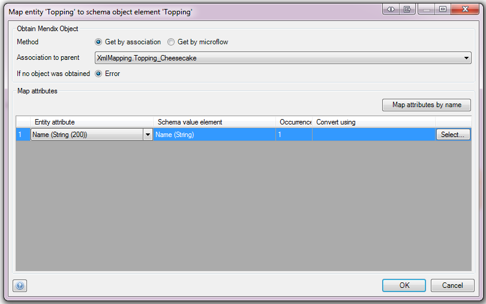
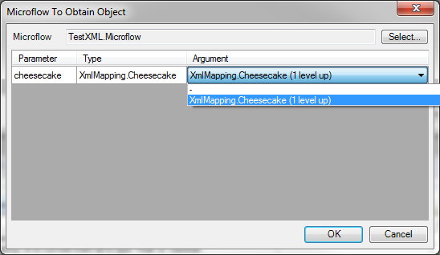
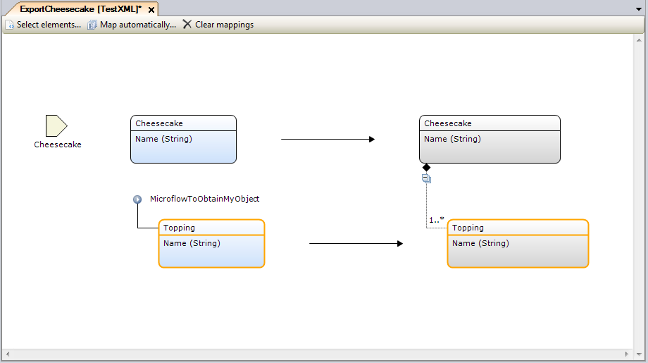
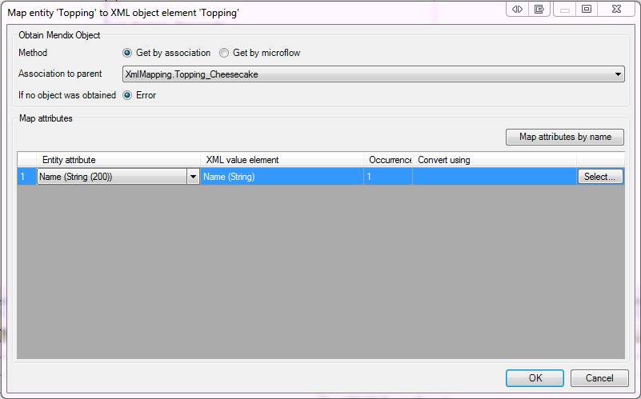
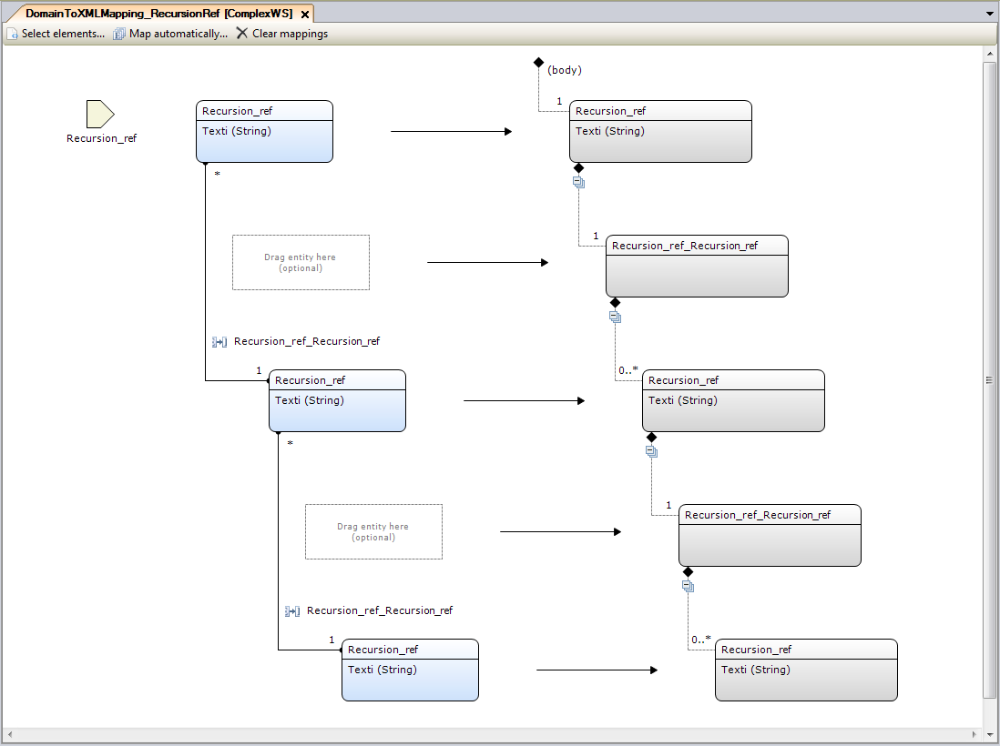

For an introduction to export mappings, refer to [Mapping Documents](mapping-documents).

## 1 Obtaining Objects in Export Mappings

The image below shows an example of an export mapping document in which two elements are selected using the [Select elements](select--elements) pane. The **Cheesecake** entity (on the left) was dragged into the mapping to map to the **Cheesecake** element (on the right), and the **Topping** entity was mapped to the **Topping** element.

  **Figure 1**

Having defined what entities map to which elements, you need to configure how the Mendix objects that are to be exported should be obtained when the export mapping is invoked. The root level element (which in this case is Cheesecake) is the parameter for an export mapping; therefore, it is passed directly to the export mapping when it is invoked. You need to conigure how the other Mendix objects in the mapping should be obtained.

### 1.1 Obtaining an Object by Association

Firstly, as shown in figure 1 above, it is possible to get the objects over an association with the parent object. In the example, the Topping objects that need to be exported will be fetched at runtime using the Topping_Cheesecake association. It is possible to edit the mapping element by double-clicking the Topping entity (left) or the Topping element (right). The window in figure 2 will then be shown.

  **Figure 2**

### 1.2 Obtaining an Object by Using a Microflow

In this window, you can choose to either get the object by association with the parent (figure 3) or by microflow (the map attributes section is discussed in [2 Mapping Attributes in Export Mappings](#MappingAttributes)). If you choose to obtain the object by microflow, you can pass any of the parent objects to that microflow as arguments to help determine what object you should return. The in which this is configured is shown in figure 3.


  **Figure 3**


When you choose to obtain an object by microflow, this is shown in the export mapping document, as depicted in figure 4.

  **Figure 4**

Finally, the user can also define what should be done when the chosen method to obtain the Mendix object (by association or by microflow) fails. The first option is to throw an error and abort the mapping. The microflow that called this mapping should then handle this error. Alternatively, if the minimum occurrence of the element that is being mapped to is zero, it's possible to skip the creation of the element. The export mapping will continue for the remainder of the elements.

## 2 Mapping Attributes in Export Mappings

For each value element that the complex element encompasses, an attribute needs to be mapped from the entity. These properties are not applicable for choice or inheritance elements, because they do not contain value elements. Configuring how to map the attributes is done in the window depicted in figure 5, which is shown after double-clicking a specific mapping element.

  **Figure 5**

### 2.1 Entity Mapping Properties

| Property | Description |
| --- | --- |
| From attribute | The attribute in the domain entity that should be mapped to the element. |
| To value element | The XML element that will be filled. |
| Occurrence | Displays how often the element may occur. This can be "0..1" or "1", depending on if it is required or not. If the value is empty and the minimum required occurrence of the element is 0 (as specified by the source), the creation of the element will be skipped. If you want to never map a value to an optional element, simply disable it in the **Select elements** window. |
| Convert Using (optional) | A microflow to convert the value before performing export. |
| Map attributes by name | If this button is clicked, an effort is made to match attributes by name. A pop-up window will appear reporting what has been changed. |



It is possible to implicitly convert Mendix decimal data type to the `xs:float` type. As a result, it is possible that the resulting value will lose precision.



## 3 Optional Mapping Elements 

For some selected elements, defining an entity is optional. This is the case when the following points are true for the element:

* It does not contain any attributes
* It has a maximum occurrence of 1 (`maxOccurs="1"`)
* It is not a choice element or contained by a choice element
* It is not an inheritance element or contained by an inheritance element

An example of this is shown in figure 6.

  **Figure 6**

When no object is defined for the optional mapping, the element will always be created.
