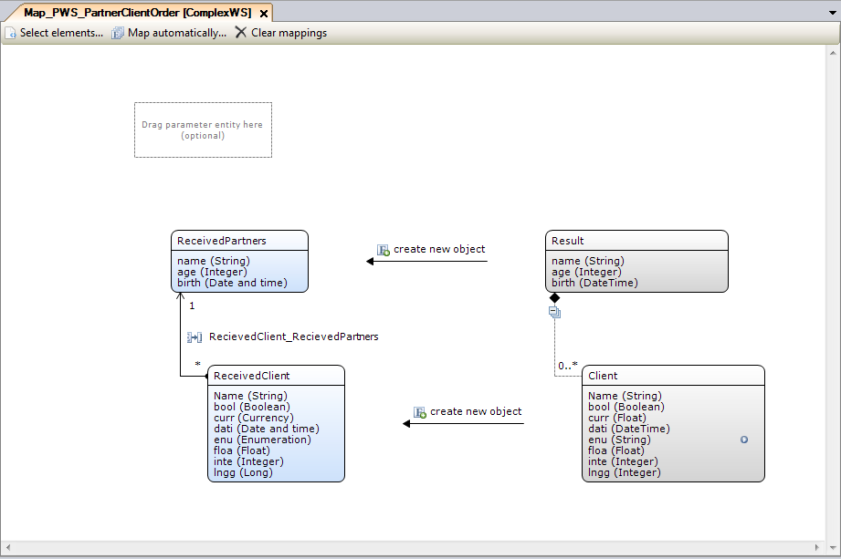
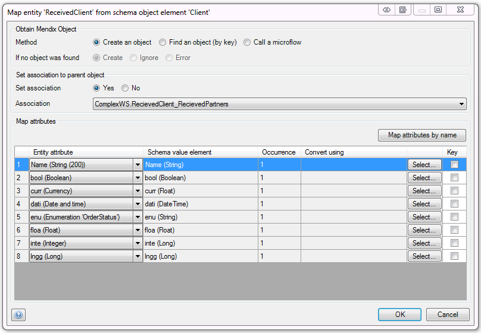
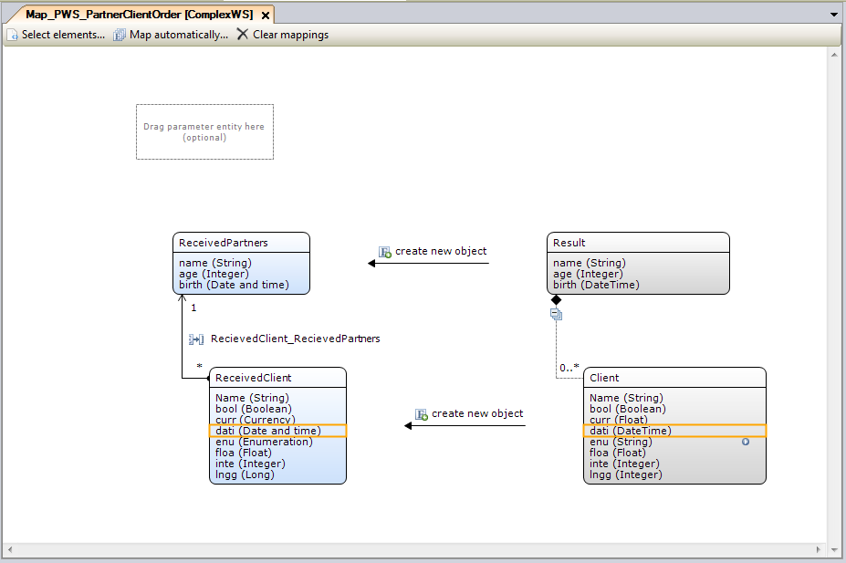
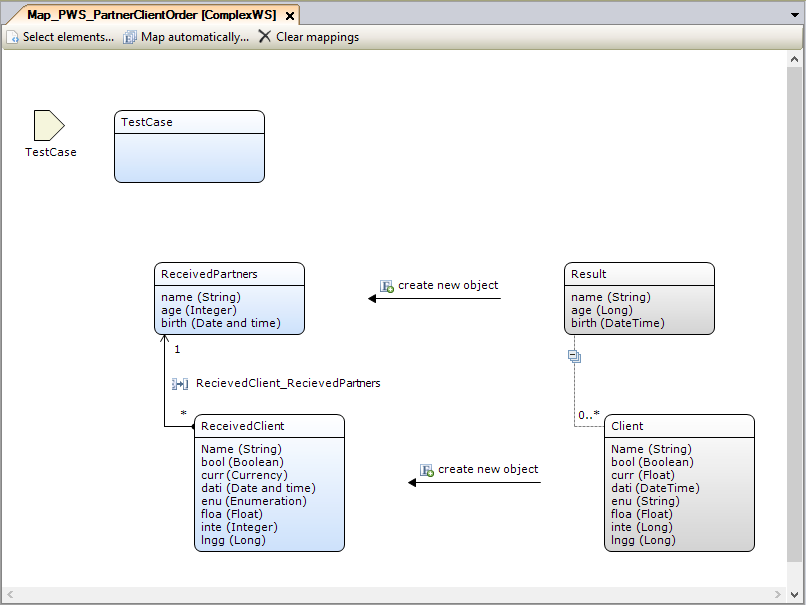

For an introduction to import mappings, refer to [Mapping Documents](mapping-documents).

## 1 Obtaining Objects in Import Mappings

Figure 1 below depicts an example of an import mapping document in which two elements from an XML schema have been selected using the **Select elements...** pane. Following this, the **ReceivedPartners** and **ReceivedClient** entities were added and mapped to the **Result** and **Client** schema elements. Each time the import mapping is invoked, a new ReceivedPartners object is created.

  Figure 1

### 1.1 Obtaining an Object

For each XML or JSON object, a Mendix object needs to be obtained. You can either create an object or find an existing object in the database. Alternatively, you can use a custom microflow that returns an object. The window in figure 2—which is shown after double clicking a specific mapping element—depicts how to configure how a Mendix object is obtained.

  Figure 2

### 1.2 Attribute Mapping Properties

#### 1.2.1 Obtaining Mendix Object Methods

| Property | Description |
| --- | --- |
| Create an object | Simply creates a new object. Any failures in the "before create" microflows will throw an error when the mapping gets applied. |
| Find an object (by key) | Searches for an object using the keys defined in the attributes list. The runtime searches for the object by taking all the attributes marked as "Key" (in [2.1 Mapping Attribute Properties](#MappingAttributeProperties) below) and converting them to an XPath query. If more than one object is returned by the XPath query, an error will be thrown. |
| Call a microflow | Calls a microflow to obtain an object. If the microflow expects any parameters, these need to be specified in the **Select...** window. Possible parameters are the input parameter, any parent entity in the mapping, and any attributes in the current XML element. |

#### 1.2.2 If No Object Was Found

This is the action that the runtime will perform when an error occurs in the specified **Call a microrflow** action.

| Property | Description |
| --- | --- |
| Create | Creates a domain entity to map to. |
| Ignore | Does not map this element and continues parsing the rest of the XML. |
| Error | Explicitly stops parsing the XML and throws an error. This error needs to be handled in the calling microflow. |

### 1.3 Setting Associations

Optionally, you may set an association to the parent object. If set to yes, a list of allowed associations is shown. If an association is selected, it is drawn in the mapping document.



Be aware that lists are not ordered in the Mendix database. XML schemas can prescribe that a grouping of objects is a sequence, but the order of Mendix objects in the database may differ from the order of incoming XML elements.



## 2 Mapping Attributes in Import Mappings

Each selected XML or JSON element needs to be mapped to an attribute in the domain entity. If you don't want to map certain elements, simply uncheck them in the **Select elements...** pane. Configuring how to map the attributes is done in the screen depicted in figure 3, which is shown after double-clicking a specific mapping element.

  Figure 3

Having defined the mappings for the attributes, these mappings are also shown in the mapping document. When a specific attribute is selected, the element is also selected. This works the other way around, too. An example of this is shown in figure 4, where the `dati` attribute is selected in both the entity and the schema element (in this case, `dati` is mapped to `dati`).

  Figure 4

### 2.1 Mapping Attribute Properties

| Property | Description |
| --- | --- |
| Entity Attribute | Here you can select an attribute to map this value element to. Each value mapping needs to be mapped, except when it is used as a parameter in the microflow to obtain an object. |
| Value element | The name and type of the value element. |
| Occurrence | Reflects how often the element may occur. This can be "0..1" or "1", depending on if it is required or not. If the value is empty and the minimum required occurrence of the element is 0, the creation of the element will be skipped. If you never want to map a value to an optional element, simply disable it in the **Select elements...** pane. |
| Convert using (optional) | If the incoming data of a value element is not in the right format, you can use a microflow to convert it to a different data type. The conversion microflow should have one parameter that matches the element type. Alternatively, the parameter may be of the string type, as all incoming data is a string. For example, when the incoming data contains an exotic DateTime format, you can parse this format by using a conversion microflow with a string parameter. If this value element maps to an attribute, the return type of the conversion microflow must match the attribute type. Conversion microflows of value elements are executed before these value elements are used as search keys or microflow parameters to obtain an object. This means that when using a value element with a conversion microflow as a parameter for the microflow to obtain an object, the parameter type should match the return type of the conversion microflow. |
| Key | This property specifies whether the value element is used as search key to obtain an object. If a value element is used as a search key, you must specify the attribute to which it maps. The XML value will be matched to the value of this attribute when searching for an object. An attribute with a "binary" type is not supported to be set as the key. |
| Map attributes by name | If this button is clicked, an attempt is made to match attributes by name. A pop-up window will appear reporting what has been changed. |

## 3 Parameter Entity

Import mappings have the additional option to pass an incoming entity. This entity is created or retrieved in the microflow that calls an [import-from-mapping](import-mapping-action) action, and it is passed as a parameter. This parameter entity serves as an input to the import mapping, and it is not created in the mapping itself. Associations can be set to the parameter entity, and the parameter entity can be used in microflows to obtain objects. 

In the example of figure 5 below, a **TestCase** entity is passed to the import mapping, and it is used in the microflow that obtains an order (Call_PWS_ReturnsOrder). Associations can be set to the input parameter as well.

  Figure 5

