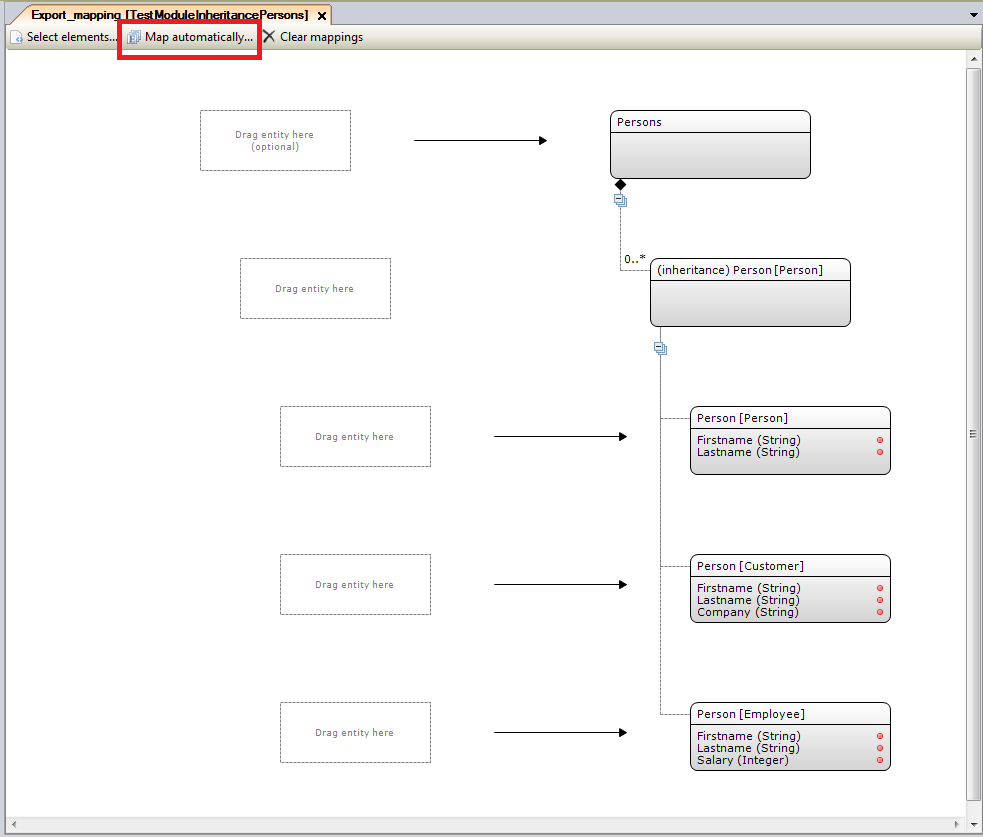
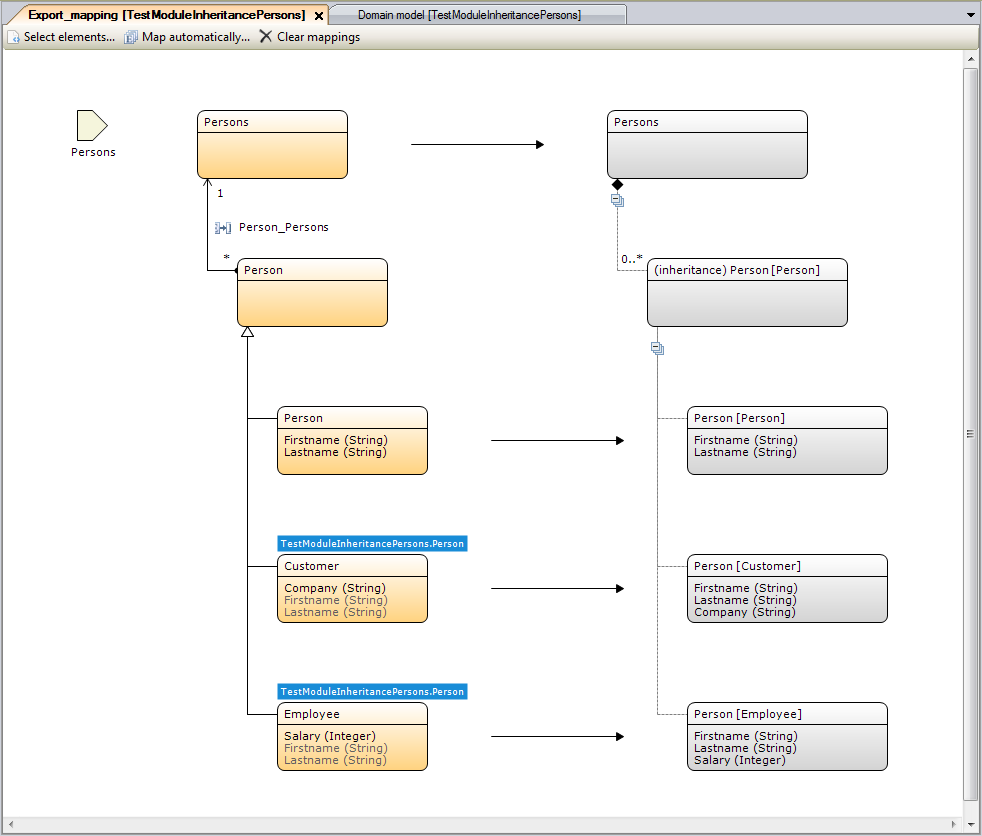
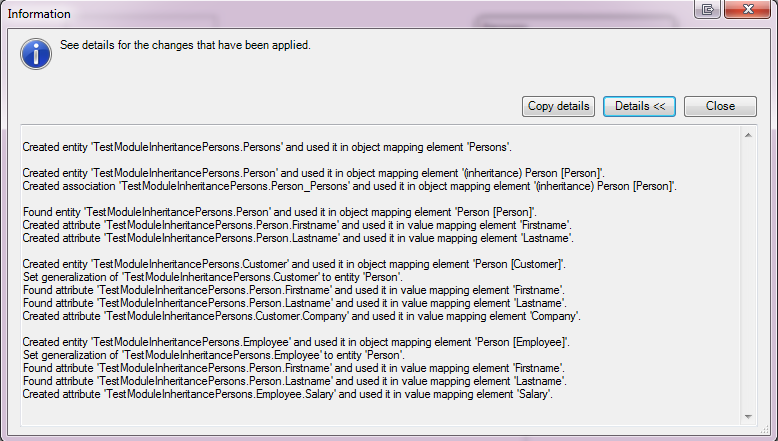
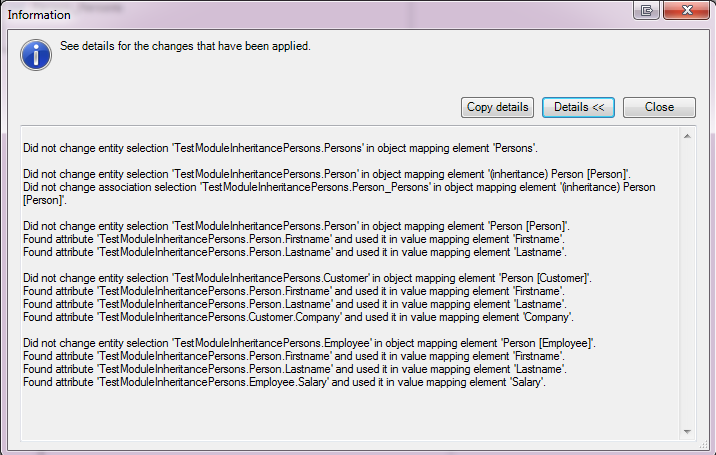

## 1 Creating Entities, Attributes, and Associations from Import or Export Mappings

After you have selected a source for the mapping document, you need to connect it to entities, associations, and attributes. When you do not yet have suitable entities available in your domain model, creating new ones by hand can be quite cumbersome, especially in large mappings. The **Map automatically...** button does the majority of the work for you. Based on the selected elements, it creates domain model entities and uses them in the mapping.

In the above image, no entities are connected to the elements, and the domain model in the module is empty. After clicking **Map automatically...**, the situation looks like this:

The following actions will be applied:

* Entities are created for each source object element (the name is set to the complex type name in the source)
* For XML extension types and choice options, the entity generalization is set to the entity corresponding to the XML base type or the choice container
* The entity attributes are generated for source primitive types and attributes

A pop-up window will be shown with the changes that have been applied to the domain model and the mapping document (to expand the window, press **Details**):

## 2 Using Existing Entities, Attributes, and Associations

If the domain model already contains entities that map to elements, they are reused in the mapping. By default, an entity with the same name of the schema type is used. New attributes may be added, or a generalization may be set if the entity did not already have one. New associations may be created as well if they do not yet exist. The results pop-up window reports if it reuses existing domain model elements:

## 3 Limitations

The parameter entity for import mappings is not created by **Map automatically...**. By default, non-persistable entities are created. You can change that manually in the domain model.

Note that **Map automatically...** is not going to create entity generalization if there is any impact on the persistence behavior of the entity.

## 4 Manual Verification

**Map automatically...** is a helper tool, as it creates domain model entities and associations to relieve you from doing a lot of manual work. It is advised that you make sure the changes in the domain model are correct. You can use the reporting pop-up window or look at the **Changes** pane of the Modeler to see what has been changed effectively. Often, in more complex mappings, you may want to rename elements in the domain model, reconnect elements to other attributes, or revise entity generalizations. Be aware that if a generalization is set to an entity, this may have consequences for the database tables that store Mendix objects.
