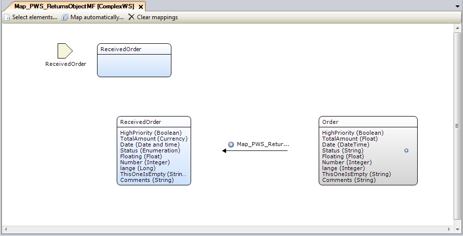
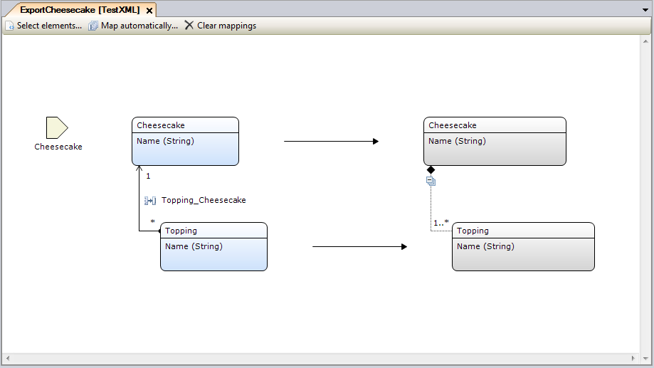

Mapping Documents are used to define how Mendix objects can be converted to and from XML or JSON, according to a specific XML schema or JSON structure. There are two types of mappings: [import mappings](import-mappings) and [export mappings](export-mappings).

## 1 Import Mappings

Import mappings are used to define how incoming XML or JSON is converted into Mendix objects, according to a specific XML schema or JSON structure. This is needed to be able to interpret data received from other systems. In Mendix, there are three basic scenarios for converting XML or JSON to Mendix objects:

* Receiving XML from a web service (defined in an [imported web service](consumed-web-service)) in a [call web service action](call-web-service-action) activity
* Receiving XML or JSON from a [call REST action](call-rest-action)
* Importing XML or JSON directly in an [import from mapping](import-mapping-action) action

This is an example of an import mapping document:

    Figure 1

For more details on import mapping, see [Import Mappings](import-mappings).

## 2 Export Mappings

Export mappings are used to define how Mendix objects can be converted to XML or JSON, according to a specific XML schema or JSON structure. This is needed to be able to send data to other systems in a format that the other systems can process. In Mendix, there are three basic scenarios for converting Mendix objects to XML:

* Sending XML to an [imported web service](consumed-web-service) in a [call web service action](call-web-service-action) activity
* Passing XML or JSON to a [call REST action](call-rest-action)
* Exporting XML or JSON directly in an [export with mapping](export-mapping-action) action

An example of an export mapping document is depicted here:

    Figure 2

  

In this example, the **Cheesecake** entity will be passed when the export mapping is called. Subsequently, the **Topping** entities will be fetched by following the **Topping_Cheesecake** association from the passed Cheesecake Mendix object. The result is passed to an XML document or sent to a web service.

For more details on export mapping, see [Export Mappings](export-mappings).

## 3 Creating a New Mapping Document

To specify an import or export mapping, follow these steps:

1. Create a new **Import Mapping** or **Export Mapping** document.
2. Click **Select elements...** to select an XML schema, imported web service document, JSON structure document, or entity as the source schema for this mapping.

    


    If the schema is large, a subset of elements can be selected so you don't have to map all of them. For details on how to do this, see [Select Elements](select--elements).

    

3. Click **OK**. A structure is created with placeholders for entities on the left side, and the selected elements are on the right side.

    It is possible to include a parameter entity in mapping documents. Mapping documents with a parameter entity need to be invoked (in a [call web service action](call-web-service-action) or [export with mapping](export-mapping-action) action) by passing a parameter of the configured type. Mapping documents without a parameter entity can be invoked without passing a parameter. For import mappings, a parameter entity can be included by dragging one onto the placeholder in the created structure using the **Connector** tool. Export mappings always need to have a parameter entity (the object that is being exported) and the mapped root element is used for this. In both cases, the parameter entity is depicted as a yellow arrow parameter symbol.

4. Map child elements. Entities are obtained by associations, from a custom microflow, or by entity specializations (in the case of choice or inheritance XML elements).

5. Finally, configure how entity attributes map to the XML or JSON structure.

## 4 Convenience Functions

* Map automatically
    * Automatically look for entities and associations in the domain model that can be used in the mapping
    * If a matching entity or association is not found, it is created in the domain model
    * This function is explained in more detail in [Map Automatically](map-automatically)
* Clear mappings
    * Disconnects all mapping elements in the document from entities and associations
    * They are not deleted in the domain model

## 5 Tip: Important Windows

Mapping documents rely heavily on two windows. If they are not visible in the Modeler, they can be enabled from the **View menu**.

* **Properties window** – details of the individual mapping elements are shown here
* **Connector window** – entities from the **Connector** window are dragged into the mapping document

## 6 User Interactions

| Action | Description |
| --- | --- |
| Dragging entities | Drags an entity from the **Connector** window and drops it on an entity placeholder (dashed box) to relate it to an XML element. |
| Double-clicking a mapping element (on either the entity side or the XML side) | Opens a dialog box that allows you to specify details for the individual mapping. If the element is not yet related to an entity, a dialog box appears that lets you select the entity first.
| Right-click **Select Entity** | Changes the entity that is coupled to an XML element.
| Right-click **Go to Entity** | Open the domain model that contains the entity and jumps to the entity.
| Right-click **Collapse All** | Hides all the children of the mapping element so that you can keep an overview in large mappings.
| Right-click **Expand All** | Expands all the children of the mapping element. All the underlying elements become visible.
| Click **-** (below mapping element) | Makes the underlying elements invisible.
| Click **+** (below mapping element) | Makes the underlying elements visible.

## 7 Common Properties

| Property | Description |
| --- | --- |
| Name | The name of the mapping. |
| Documentation | Here you can specify extra information to explain what this mapping does. |
| Web Service Operation Properties | This category is only filled if the mapping is for a web service call and not for an XML schema. |
| Web Service | The name of the imported web service that this mapping is for. |
| Service name | The actual name of the service, as it is defined in the WSDL of the imported service. |
| Operation name | The name of the specific operation in the service that this mapping is meant for. |
| Request part | This is the name of the header or body parameter that this mapping is for. It is only applicable for export mappings. If the mapping is for all body parameters, the value is "Body". |
| XML Schema Properties | This category is only filled in if the mapping is for an XML schema and not for a web service call. |
| XML Schema | The name of the XML schema that this mapping is for. |
| Start at | This determines which part of the XML structure this mapping defines. |
| Send empty values | This is only applicable for export mappings. If a mapping element is optional and nillable, you need to select whether or not to send the empty values. The default is no. |
