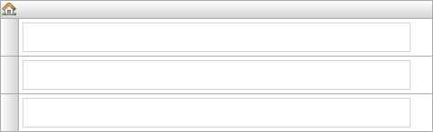

A navigation list can be used to attach an action to an entire row. Such a row is called a navigation list item.



A navigation list with three empty rows.



## Common properties





# Navigation list item

Each row in the navigation list is a navigation list item. A navigation list item can be associated with an action. Conditional visibility is available for list items.

## General

### Action

Action defines what action is performed when a navigation list item is 'clicked'. This can either be opening a page or calling a microflow. For opening a page see [Opening Pages](opening-pages) and for calling a microflow see [Starting Microflows](starting-microflows). Microflows attached to a navigation list item have no Confirmation or Advanced microflow settings.

## Visibility properties




