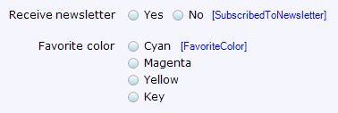

The radio buttons widget is an [input widget](input-widgets) that can be used to display and edit boolean and enumeration attributes.



These radio buttons are used to indicate whether the user wants to receive the newsletter (boolean, rendered horizontally) and to select his/her favorite color (enumeration, rendered vertically).



## General properties

### Orientation

This property defines whether the radio buttons are rendered horizontally or vertically.

_Default value:_ Horizontal





## Data source properties





## Editability properties







## Visibility properties





## Events properties



## Common properties



 

 



## Related articles

*   [Data view](data-view)
*   [Attributes](attributes)
