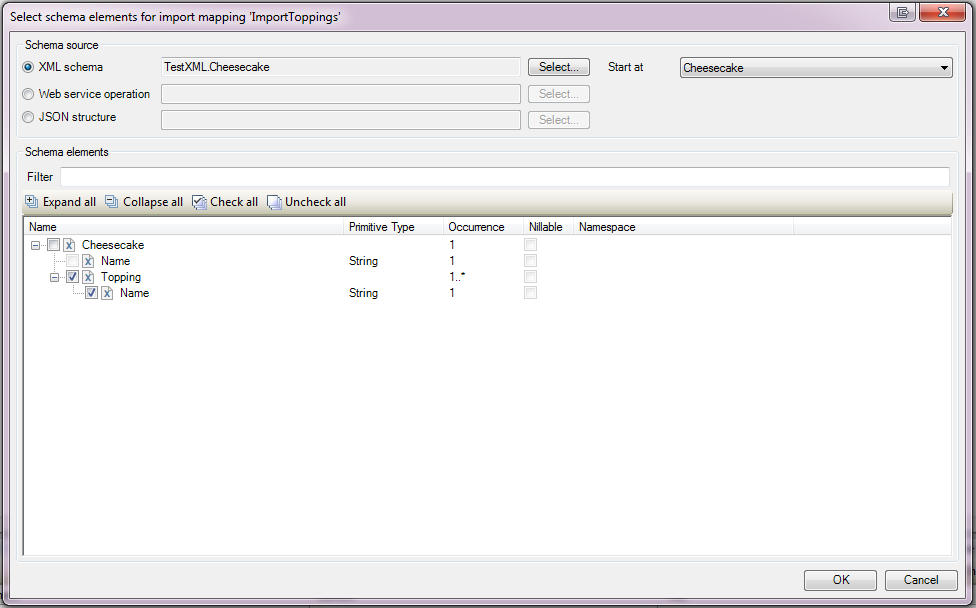

## 1 Overview

For both [import](import-mappings) and [export mappings](export-mappings), you need to specify the schema structure that you want to map. You do this in the **Select schema elements** window, an example of which is shown below.

Perform the following steps in the **Select schema elements** window:

1.  Select the schema source on which you want to base the mapping. This can be either an [XML schema](xml-schemas), a [Consumed web service](consumed-web-services), a [JSON structure](json-structures), or an [Entity structure](entity-structures).
2.  If you selected an XML schema or a web service operation as the source, then select the root element of the mapping. Do this by selecting the **Start at** element for the XML schema or the **Request part** for the web service operation. **Start at** lists the root elements in an XML schema. You can select one root element to base your mapping on. If the source is a web service operation, the **Request part** lists the header and body element of the request part of an operation. If an operation has multiple parameters, these are listed in the **Request part** as well. The **Request part** is only applicable to export mappings.
3.  Select the specific elements in the tree explorer. Typically, you do not need to map an entire source, since they can be quite large.



If the contents of the used schema source change, the mapping document does not match the schema anymore and a consistency error is shown. This consistency error is easily fixed by right-clicking the consistency error itself and selecting **Resolve by updating from schema**.

Schema contents can change by importing a changed XML schema or an WSDL, or by changing the JSON structure or entity structure.



## 2 Rules and Restrictions

Keep in mind the following rules and restrictions for element selection:

*   Unsupported elements cannot be checked.
*   A value cannot be checked without a parent element.
*   The top level element cannot be unchecked (export mapping only).
*   An attribute cannot be checked without checking its parent element (export mapping only).
*   An element with minimum occurrence 1 cannot be unchecked (export mapping only).
*   If a choice or inheritance element is checked, at least one of its children needs to be checked.

For ease of use, some elements will automatically be checked or unchecked:

*   If you check elements with mandatory children the required children will be automatically checked. 
*   Similarly, when unchecking an element in the export mapping the children of the element will be unchecked. 

When working on an import mapping you are allowed to skip elements in the hierarchy but still select the children. You can do this when you're not interested in the information stored in the intermediary elements.



You may encounter element selection checkboxes that are greyed out. If you hover the mouse over the checkbox, you see which rule or restriction prevents you from changing the checkbox value. For example, you may need to select a parent node first before you can select a child node.



## 3 Convenience Functions



| Function | Description |
| --- | --- |
| Filter | Expand and filter the tree nodes based on whether the name contains the filter text. Because the filtering behavior relies on the 'Expand All' behavior, in very big schemas all elements matching the filter are not guaranteed to be found. |
| Expand all | Expands the entire tree, unless a node is a duplicate of one of its ancestors, or the number of expanded nodes is too large. The maximum of nodes per expand operation is currently 1,000. |
| Collapse all | Collapses the entire tree, so that only the root node remains visible |
| Check all | Checks the box next to every expanded node and visible leaf node. Collapsed nodes and their children are not affected. |
| Uncheck all | Unchecks the box next to every expanded node and visible leaf node. Collapsed nodes and their children are not affected. |



