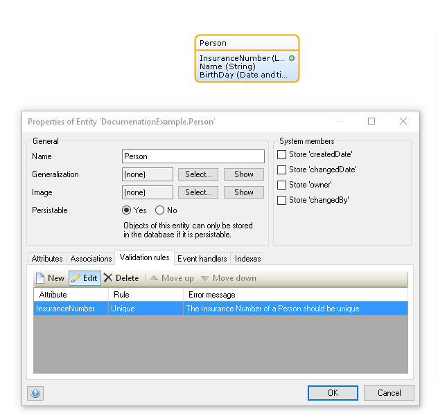
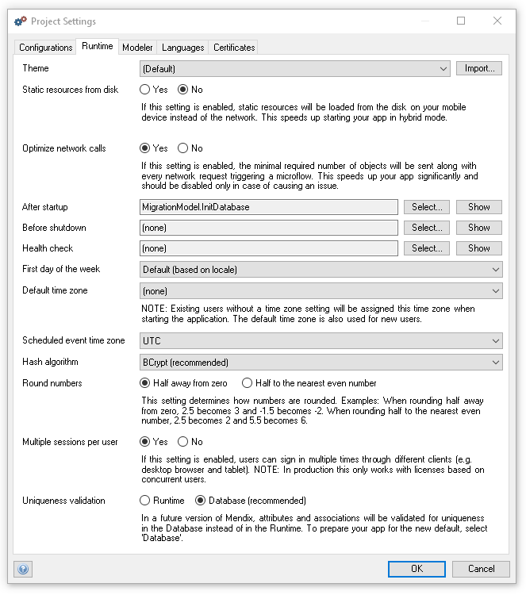
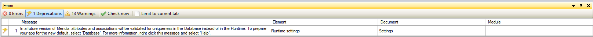
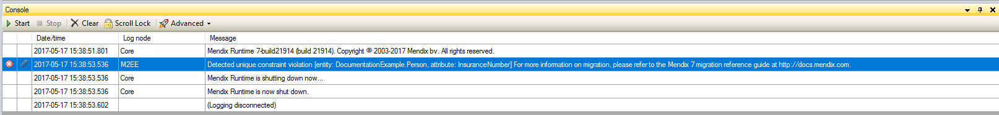
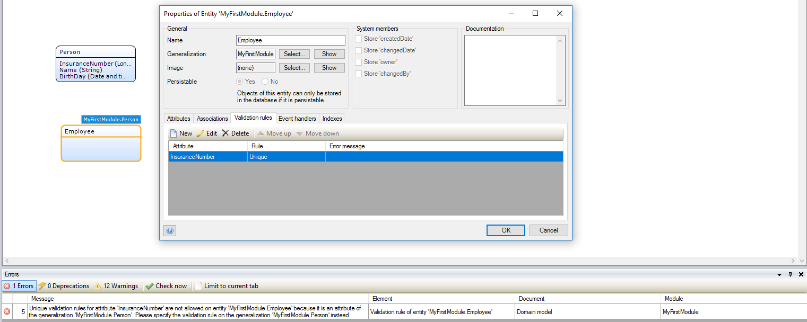
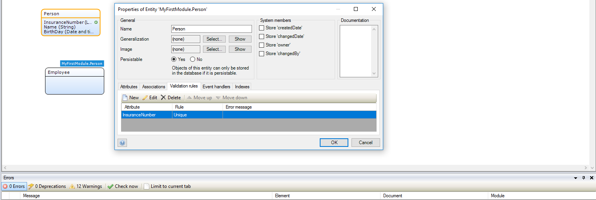
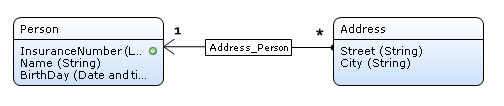
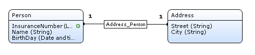
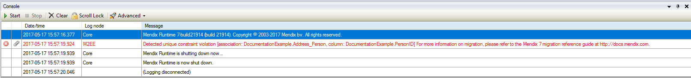

To ease the development and deployment improvements of an application, up to Mendix 7 data validation was handled in the Mendix runtime. This meant that older data could remain in the database unchanged, even if newer versions of your domain model would add more strict validation rules.

Mendix 7 focuses on stateless clustering, higher number of concurrent users, and higher load applications. For efficiency reasons some data validation will be handled by the application database. This means that data in your database will always have to comply with your validation rules, even if you make these validations more strict after the data has been created.

This document outlines the impact these changes have on your projects. We will also discuss how you can migrate your existing data when you are deploying changes to your domain model validations. Finally, even if you are not making changes to your application, data you already have may be incompatible with your current validation rules. This document will discuss how you can ensure your existing data complies with your existing project model so you can deploy in Mendix 7 with database constraints.

The following rules will also be validated in the database as of Mendix 7:
* Unique rules on entity attributes,
* The many side of one-to-many associations and both sides of one-to-one associations.

A migration toolkit is available to help you fix any inconsistencies between data in your database and validation rules defined in your model.

## Unique attributes

In previous versions of Mendix, you could change an entity and add a unique validation rule on an attribute without affecting current data. For example, you could indicate in your domain model that an insurance number should be unique for a person in the database because you wanted to use it to uniquely identify someone.

Applying the validation rule did not affect persons that were already stored in the database, before you deployed a new version of the app with a stricter data model. Only for new persons the insurance number would be checked for uniqueness compared to other persons.

The advantage was that the stricter model did not affect current data, but the disadvantage was that it was easy to make mistakes and wrong assumptions about unique data in the database. For example, logic in a microflow could depend on unique insurance numbers, and the presence of old data with duplicate insurance numbers could easily be overlooked.

In a future version of Mendix 7, we will not allow this situation anymore. As a transition, we provide a runtime setting that, if set to 'Database', will enforce unique validation rules on a database level.

We highly recommend to set this radiobutton to 'Database'. This will prepare your app for future versions of Mendix. If the radiobutton remains set to 'Runtime', a Deprecation warning will appear:

What is the effect of selecting 'Database'? When you deploy a model with unique validation rules on attributes (existing rules or new rules), all existing objects for the affected entity will be checked for uniqueness of the attribute. If there are multiple persons with the same insurance number, an error will be shown on deployment (if you deploy from the Modeler). If you deploy the app in the Mendix cloud, the app will not start and errors will be written to the logs.

However, with 'Database' uniqueness validation option enabled, defining unique validation rules on specialized attributes in a specialization entity is not allowed.
For any specialized attribute with unique validation rule defined in the specialization, the appropriate consistency error is reported like on the picture below.

These unique validation related inconcistency errors may be simply resolved by moving unique validation rules of specialized attributes to a generalization entity.

## Unique associations

A comparable situation occurs for associations. Consider the following example.

Initially, the domain model contains a 1-to-many association between Address and Person. This means that a Person can have multiple addresses. After some time, the data structure is changed because logic has been added to the app that only allows one Address per Person. Proper data modeling prescribes to change the association into a 1-to-1 association. New data will reflect the updated association properly.

Since Mendix 7.3, we enforce that existing association data in the database adhere to the updated 1-to-1 association too. This is checked at deployment as well. If a person has multiple addresses, the model will not deploy and an error will be given in the Modeler or in the logs of deployment in the (Mendix) cloud:

We enforce the new, stricter, association on existing data to avoid easily overlooked mistakes resulting in returning only a single address per person where in fact it still has multiple in the database. The Mendix platform consistently returned the same address each run, but other addresses would be dormant entries in the database.

## Help with Migration

To help with migrating your old data, Mendix has developed a Migration Toolkit for Mendix 6 and Mendix 7.   
For more detailed information, please contact our support team at [support.mendix.com](http://support.mendix.com).
