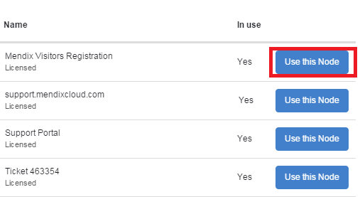

## 1 Introduction

This how-to describes how to connect a different Mendix project to your licensed cloud node so that you can deploy a different app.

**This how-to will teach you how to do the following:**

*   How to connect a different project to your node which already has a connected project
*   How to exchange projects between two nodes

## 2 Prerequisites

Before starting this how-to, make sure you have completed the following prerequisites:

*   Your project is a Team Server project

    > If you created a project in the Modeler you can upload it to the Team Server and a repository will be created automatically. See [Upload To Team Server Dialog](https://docs.mendix.com/refguide6/upload-to-team-server-dialog) for more information.

*   You don't have a Free App connected to your project

    > You can raise a ticket with [Mendix Support](https://support.mendix.com/) to delete your Free App. Select the template *Delete Sandbox*.

## 3 Connect A Different Project To The Node

1.  Go to the **Developer Portal**.
2.  Go to **Projects** and select the project you want to connect to the node.
3.  Go to the **Deploy** tab.
4.  Click **Select Node**.

    > If your project is still connected to a Free App, follow the [How To Connect A Project To A Licensed Cloud Node ](how-to-unlink-your-sandbox) how-to to learn how to remove it.

5.  Click **Use this Node** for the node you want to connect. The current connected project will be disconnected automatically.

    

## 4 Exchange Connected Projects Between Nodes

If you want to exchange two projects with nodes who are already connected, you can create a new project and follow chapters 1 to 3 of this document.

### 4.1 Example
In this example we'll show you how to exchange connected projected between nodes. You will start by disconnecting Project A from Node 1, connecting it to Node 2, and then connecting Project B to Node 1.

* Project A → Node 1
* Project B → Node 2

1.  Create a new, empty project (Project C).
2.  Connect **Project C** to **Node 1**. This will disconnect Project A from Node 1. 
3.  Connect **Project A** to **Node 2**.
4.  Now connect **Project B** to **Node 1**.

The connected projects have now switched nodes. Project C is merely a placeholder used to remove Project A from Node 1. After the operation is completed Project C can be safely deleted.

## 5 Related Content
*   [How To Unlink Your Sandbox](how-to-unlink-your-sandbox)
