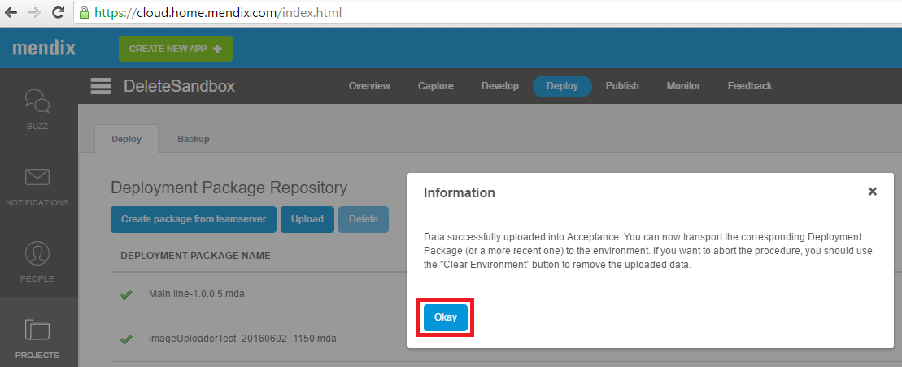

This how-to describes how to restore a backup to a sandbox/free app or licensed node.

**After completing this how-to you will know:**

*   How to restore a full back up of a sandbox/free app.
*   How to restore a full back up of a licensed node.

## 1. Preparation

Before you can start with this how-to, please make sure you have the following prerequisites.

*   A sandbox/free app or licensed node available.
*   A backup from a sandbox/free app.

## 2\. Downloading a backup

The documentation on how to download a backup can be found [here.](how-to-download-a-backup)

## 3\. Restoring a backup

There is a difference between restoring a backup from a sandbox/free app and licensed node.

### 3.1 Restoring a backup for a sandbox/free app.

1.  Go to ‘home.mendix.com'

2.  Click on ‘Dev Portal’

    
3.  Go to the projects tab.

4.  Then select the project where you want to restore the backup to.
    

5.  Go to the ‘deploy’ tab.

    
6.  Click on the ‘backup’ tab.

    
7.  Select the backup you want to restore and then click on restore backup.

    
8.  Click on ‘yes’ to confirm to the restore.

    
9.  The backup has been restored.

### 3.2 Restoring a backup for a licensed node.

1.  Go to ‘[home.mendix.com](http://home.mendix.com)'
2.  Click on ‘Dev Portal’
    
3.  Go to the projects tab.
4.  Then select the project where you want to restore the backup to.
    
5.  Go to the ‘deploy’ tab.
    
6.  Click on the ‘backup’ tab.
    
7.  Click on ‘upload data’.
    
8.  Select the downloaded database and uploaded files. (These files can be downloaded from other environments) Then click on restore.
    
9.  Click 'stop and clear' if you are certain the environment has been back upped.
    
10.  The cloud portal will clear your environment and ask to upload the data. Click 'upload'.
    
11.  The cloud portal has uploaded the data and can now be used to be deployed to the environment. Click 'Okay'.
    
12.  Select the backup you have just created and want to restore. Then click on 'Restore Backup'.
    

13.  Select the environment the backup should be restored to. Then click on restore backup.
    

14.  Click on 'yes' to confirm to transport the backup to the environment.
    
15.  The backup has been restored to the licensed node.
