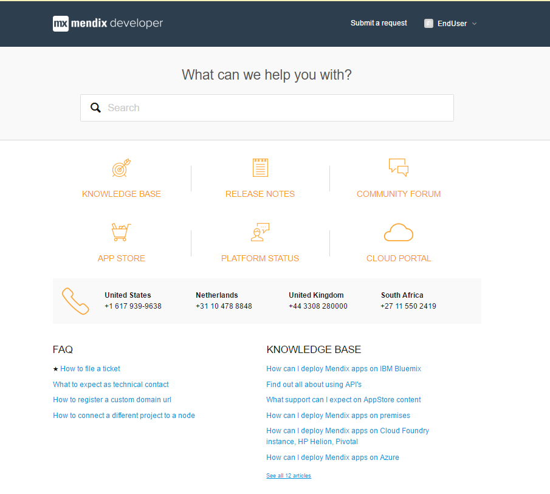
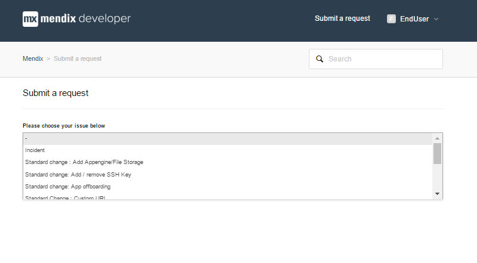
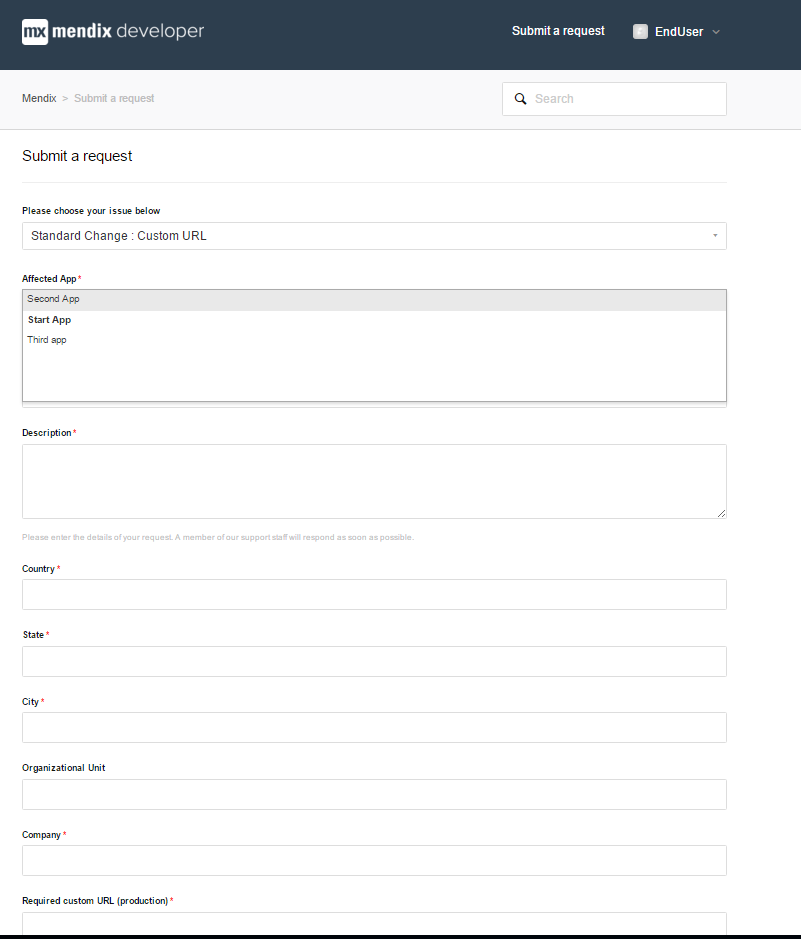
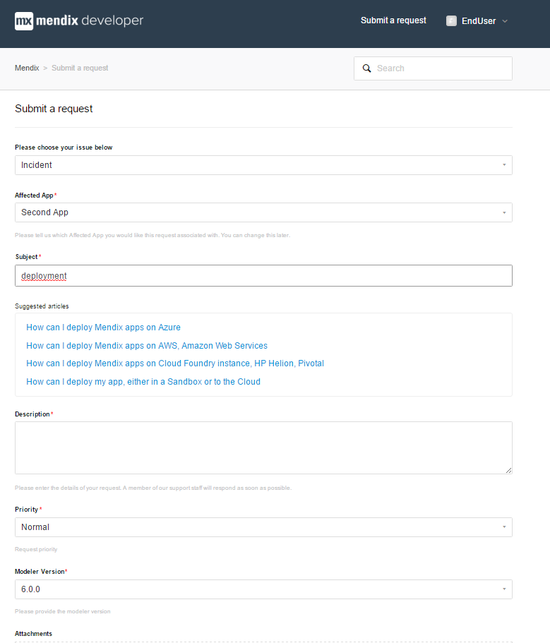
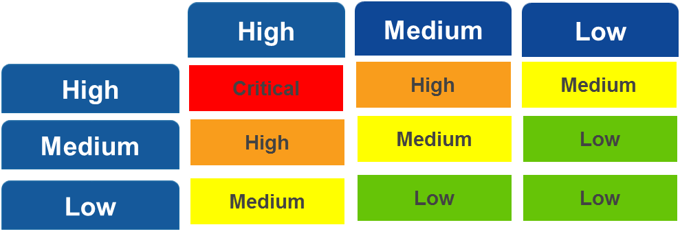
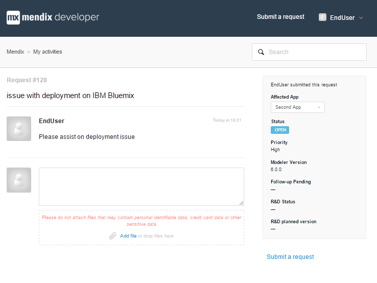
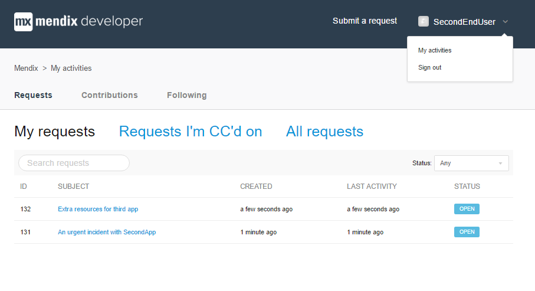
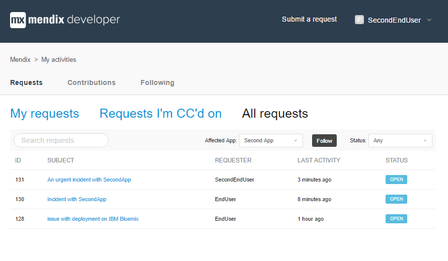
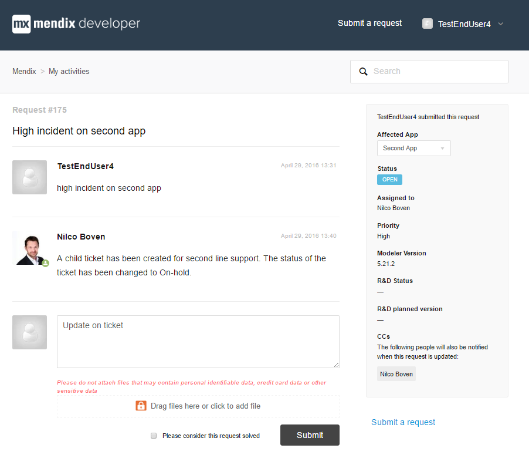

## Introduction
This how-to will explain how you can submit a request with Mendix Support.

## The Support Portal Home Page
You can access the Mendix Support Portal at [support.mendix.com](https://support.mendix.com).

This home page lets you access various Mendix sites that provide important information or tools:

*   [Mendix Documentation](https://docs.mendix.com)
*   [Release Notes](/releasenotes/)
*   [Mendix Forum](https://forum.mendix.com)
*   [Mendix App Store](https://appstore.mendix.com)
*   [Platform Status](https://status.mendix.com)
*   [Cloud Portal](https://cloud.mendix.com)

The search box lets you search through the Mendix Documentation for relevant information.

## Submit A New Request

If you can't find the answer to a question on the Mendix Forum or in the Mendix Documentation, you can submit a request. The Support Portal will walk you through the ticket creation and asks for relevant information based on the type of request. Follow these steps to submit a request with Mendix Support:

1.  Click **Submit a request**.
2.  Select an issue from the drop-down.

  

3.  Fill in the fields for the issue type you selected.

There are certain fields that you always need to fill in. The most important one is the affected app. You can choose from every app you have access to. You access level is determined by your Project Role in the Developer Portal. There is always a default company account that you can use to submit general tickets. 

Other fields only appear for certain issues, like the example below.

When you enter the subject of the request, the Support Portal will suggest relevant documentation for you to read before before submitting the request.

 

If that does not work out, you can submit the request.

## Request Priority
You can select the priority you feel the request should have. Please note the SLA regulations for this priority, which can be checked online as well.

The priority is based on the combination of impact and urgency.

Impact:

*   High: A high priority production issue with a high impact on the customer’s business, impacting (almost) all users
*   Medium: A production issue with intermediate impact on the customer’s business, impacting a group of users
*   Low: A trivial production issue with no impact on the customer’s business.

Urgency:

*   High: The operational functionality is severely disrupted.
*   Medium: The operational functionality is limited disrupted
*   Low: The operational functionality is hardly disrupted.

You can set the priority to:

*   Critical
*   High
*   Medium
*   Low

The priority follows from the following matrix.

You can add large attachments such as project files to the ticket. Please note that Mendix advises not to attach any files that contain personal identifiable data, credit card information or other sensitive data.

Click **Submit** when you're ready to submit the request.

 

## Overview Of Requests

By selecting your name on the top right hand side, you can select My activities and see all requests that you have submitted and all request that have been submitted on the apps that you have access to.

When you Follow a specific app, you will be informed on all changes on requests on that specific app.

## Viewing and updating tickets 

From the overview you can easily open a specific ticket or you can search a ticket by using the Search Requests option. Once you have opened the ticket you can add comments to the ticket assignee or add new attachments.

The ticket can have the following statuses:

*   Open : ticket is wit Support department
*   Pending : ticket is awaiting your reply
    You will receive one reminder email before the portal automatically closes the ticket. If you reply the ticket will be automatically set to Open again.
*   On-hold : ticket is forwarded to our second-line support
    You will be informed on the R&D status and planned version once we receive response from our second-line.
*   Solved : ticket has been solved
    If you reply the ticket will be automatically opened again.
    You can close the ticket yourself by checking the box Please consider this request solved
    The ticket will closed for comments automatically after a set number of days. You can then submit a follow-up ticket.

 
